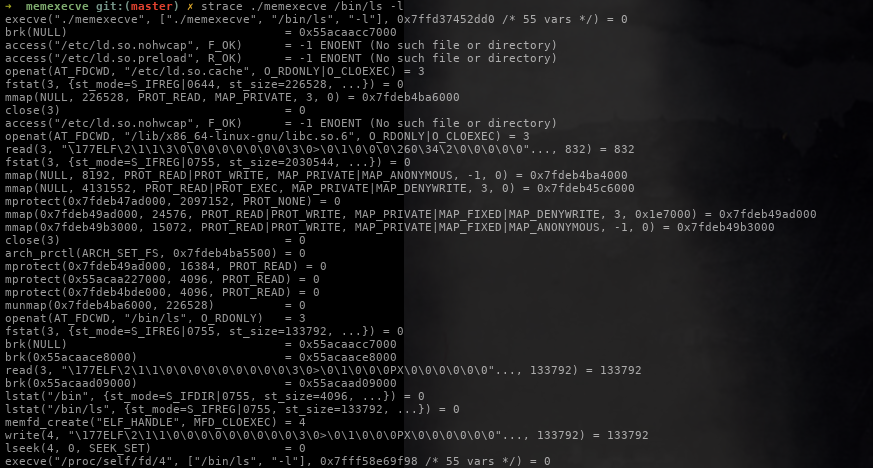

# memexecve

`memexecve` is a quick demo to demonstrate `execve`ing an ELF file in memory without ANY disk interaction. This does not serve a practical purpose at all, but is fun regardless.




## Compilation
```
gcc *.c -o memexecve
```


## Usage
```
./memexecve /path/to/binary arg1 arg2 arg3 ..
```

Whilst it looks ironic to load a file from disk at first glance, standalone code can be found in `memexecve.{c|h}`

